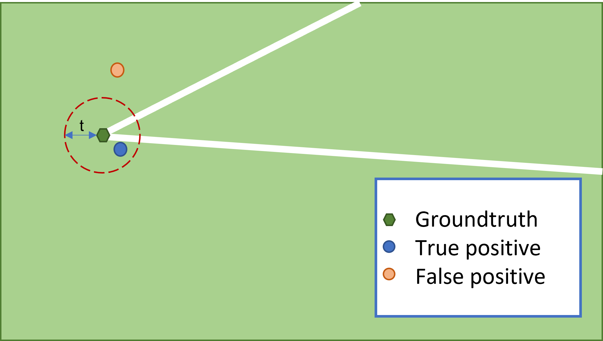

# EVS Camera Calibration Challenge

Welcome to the EVS camera calibration challenge ! This challenge is sponsored by EVS Broadcast Equipment, and is
developped in collaboration with the SoccerNet team.

This challenge consists of two distinct tasks which are defined hereafter. We provide sample code and baselines for each
task to help you get started!

Participate in our upcoming Challenge at the [CVSports](https://vap.aau.dk/cvsports/) workshop at CVPR and try to win up to 1000$ sponsored by [EVS](https://evs.com/)! All details can be found on the [challenge website](), or on the [main page](https://soccer-net.org/).

The participation deadline is fixed at the 30th of May 2022. The official rules and guidelines are available on ChallengeRules.md.

<a href="">
<p align="center"></p>
</a>

## Table of content

- Install
- Dataset
    - Soccer pitch annotations
- First task : soccer pitch elements localisation
    - Definition
    - Evaluation
    - Baseline
- Second task : camera calibration
    - Definition
    - Evaluation
    - Baseline

## Install

Make sure to have <code>git lfs</code> installed on your machine before cloning this repository to automatically download the network weights in [resources](resources).

With python 3 already installed, the python environment can be installed with the following command:

```
pip install -r requirements.txt
```

## Dataset

SoccerNet is a dataset containing 400 broadcasted videos of whole soccer games. The dataset can be found
here :   https://soccer-net.org/
The authors give access to template code and a python package to get started with the dataset. All the documentation
about these tools can be found here : https://github.com/SilvioGiancola/SoccerNetv2-DevKit

All the data needed for challenge can be downloaded with these lines : 

```python
from SoccerNet.Downloader import SoccerNetDownloader
mySoccerNetDownloader = SoccerNetDownloader(LocalDirectory="path/to/SoccerNet")
mySoccerNetDownloader.downloadDataTask(task="calibration", split=["train","valid","test","challenge"])
```

Historically, the dataset was first released for an action spotting task. In its first version, the images corresponding
to soccer actions (goals, fouls, etc) were identified. In the following editions, more annotations have been associated
to those images. In the last version of the dataset (SoccerNetV3), the extremities of the lines of the soccer pitch
markings have been annotated. As a partnership with SoccerNet's team, we use these annotations in a new challenge. The
challenge is divided in two tasks, the resolution of the first leading to the second one. The first is a soccer pitch
element localisation task which can then be used for the second task which is a camera calibration task.

### Soccer pitch annotations

Performing camera calibration can be eased by the presence of an object with a known shape in the image. For soccer
content, the soccer pitch can be used as a target for the camera calibration because it has a known shape and its
dimensions are specified in the International Football Association Board's law of the
game (https://digitalhub.fifa.com/m/5371a6dcc42fbb44/original/d6g1medsi8jrrd3e4imp-pdf.pdf).

Moreover, we define a set of semantic labels for each semantic element of the soccer pitch. We also define the bottom
side of the pitch as the one where the main and 16 meters broadcast cameras are installed.


1. Big rect. left bottom,
2. Big rect. left main,
3. Big rect. left top,
4. Big rect. right bottom,
5. Big rect. right main,
6. Big rect. right top,
7. Circle central,
8. Circle left,
9. Circle right,
10. Goal left crossbar,
11. Goal left post left ,
12. Goal left post right,
13. Goal right crossbar,
14. Goal right post left,
15. Goal right post right,
16. Middle line,
17. Side line bottom,
18. Side line left,
19. Side line right,
20. Side line top,
21. Small rect. left bottom,
22. Small rect. left main,
23. Small rect. left top,
24. Small rect. right bottom,
25. Small rect. right main,
26. Small rect. right top

In the third version of SoccerNet, there are new annotations for each image of the dataset. These new annotations
consists in the list of all extremities of the semantic elements of the pitch present in the image. The extremities are
a pair of 2D point coordinates.

For the circles drawn on the pitch, the annotations consist in a list of points which give roughly the shape of the
circle when connected.

Leveraging those annotations quite directly, a first task is defined.

## First task : Soccer pitch elements localisation

On one side, we originally thought of this challenge as a calibration challenge, but we want to allow participations
with other types of detectors. On the other side, we formulate this task as a localization task, but you could already
use camera calibration for this task. We just think that the localization of pitch elements might be a good starting
point for a camera calibration procedure, as the soccer pitch markings and goal posts have known shape and dimensions.
In this first task, we ask to create an algorithm that predicts the extremities of the soccer pitch elements present in
the image.

### Definition

Given an image, your algorithm should detect the extremities of every soccer pitch element captured in the image. A
soccer pitch element is either a pitch line marking or a goal post part. The extremities are either the end of the
line/circle arc or its intersection with the image side. Since the notion of extremities for the "Circle central"
semantic class is not well-defined, we will not use this class in the evaluation. However, note that still detecting it
might be useful for the second task.

As output for a specific game, we expect a json file containing a dictionary, whose keys are the images names (as named
by the frame extraction implemented in SoccerNet) and whose values are dictionaries of predictions. One prediction
dictionary is composed of keys that are the full name of the semantic classes that were detected in the image, and each
value is a list of two elements corresponding to each extremity. An extremity is represented by a dictionary containing
x and y keys, each key is associated with its value **normalized** by the image dimensions. If there are two different
pitch elements in the image "17_1.png", we expect a dictionary containing the following informations :
[illustration]

```
{
 "17_1.png" = {

     "semantic_class_name_1" : [{'x': x1,'y': y1}, {'x': x2,'y': y2}],
     "semantic_class_name_2": [{'x': x3,'y': y3}, {'x': x4,'y': y4}]

 },
...
}
```

The json files will be organized as SoccerNet : we expect to receive a zip archive respecting the same folder
organization. Each json file will be located in its league folder, its corresponding season folder and finally its match
folder.

```
league
  |__ season years
         |__ match 1
         |     |__ prediction_extremities.json
         |__ match 2
               |__ prediction_extremities.json
```


### Evaluation

The evaluation is indirectly based on the euclidian distance between the predicted extremities and the annotated
extremities in the image resized in 1/4 HD (960,540). Rather than using distance metrics in pixels explicitly which are
often more difficult to interpret, we formulate the evaluation using accuracy, precision and recall as for a binary
classification problem. These metrics are not evaluated for the class "Circle central" as its extremities are not
defined.

The best algorithm will be selected based on accuracy values. We define the sets of true positives, false positives and
false nagatives as follows:

* True positives : for classes that belong both to the prediction and the groundtruth, a predicted extremity is a True
  Positive if its L2 distance to the corresponding groundtruth extremity is lower than a certain threshold **t**.
* False positives : contains points that were detected with a class that do not belong to the groundtruth classes, and
  points with valid classes whose smallest distance to groundtruth extremity is higher than the threshold.
* False negatives: All points of a class only present in the groundtruth are counted as False Negatives.
* True negatives : There are no True Negatives.

The Accuracy for a threshold of t pixels is given by : **Acc@t = TP/(TP+FN+FP)**. We evaluate the accuracy at 5, 10 and
20 pixels.



Note that the order of the extremities in the prediction does not matter as we take the minimal distance to the
extremities present in the groundtruth.

A predicted extremity


is associated to a class C_p and its coordinates. The groundtruth can be expressed as a set G


Corresponding to line or circles points, each of them associated to the element class C. The condition for a predicted
point P to belong to the True positives is the following :


with _d()_ the euclidian distance function and t the threshold in pixels.

#### Dealing with ambiguities

The dataset contains some ambiguities when we consider each image independently. Without context, one can't know if a
camera behind a goal is on the left or the right side of the pitch.

For example, this image taken by a camera behind the goal :


It is impossible to say without any context if it was shot by the camera whose filming range is in blue or in yellow.


Therefore, we take this ambiguity into account in the evaluation and we consider both accuracy for the groundtruth
label, and the accuracy for the central projection by the pitch center of the labels. The higher accuracy will be
selected for your evaluation.

### Baseline

#### Method

For this first task, we define a baseline, in order to give an example. We decided to solve this task with a neural
network trained to perform semantic line segmentation. We used DeepLabv3 architecture. The target semantic segmentation
masks were generated by joining successively all the points annotated for each line in the image. We provide the
dataloader that we used for the training in the src folder.

As the task evaluation is based on the regression of the line extremities, the segmentation maps predicted by the neural
network are further processed in order to get the line extremities. First, for each class, we fit circles on the
segmentation mask. All pixels belonging to a same class are thus synthesized by a set of points (i.e. circles centers).
Then we build polylines based on the circles centers : all the points that are close enough are considered to belong to
the same polyline. Finally the extremities of each line class will be the extremities of the longest polyline for that
line class.

You can test the baseline with the following code:

```
python baseline_extremities.py -s <path_to_soccernet_dataset> -p <path_to_store_predictions>
```

And then evaluate the generated predictions:

```
python evaluate_extremities.py -s <path_to_soccernet_dataset> -p <path_to_predictions> -t <threshold value>
```

#### Results

Here are the results of our baseline :

| Acc@t    | Acc@5  | Acc@10 | Acc@20 |
|----------|--------|--------|--------|
| Baseline | 15.05% | 43.51% | 61.03% |

## Second task: Camera calibration

As a soccer pitch has known dimensions, it is possible to use the soccer pitch as a calibration target in order to
calibrate the camera. Since the pitch is planar, we can model the transformation applied by the camera to the pitch by a
homography. In order to estimate the homography between the pitch and its image, we only need 4 lines. We provide a
baseline in order to extract camera parameters from this kind of images.

### Definition

In this second task, we ask you to provide valid camera parameters for each image of the test set.

Given a common 3D pitch template, we will use the camera parameters produced by your algorithm in order to estimate the
reprojection error induced by the camera parameters. The camera parameters include its lens parameters, its orientation,
its translation with respect to the world reference axis system that we define accordingly:


#### Rotation convention

Following Euler angles convention, we use a ZXZ succession of intrinsic rotations in order to describe the orientation
of the camera. Starting from the world reference axis system, we first apply a rotation around the Z axis to pan the
camera. Then the obtained axis system is rotated around its x axis in order to tilt the camera. Then the last rotation
around the z axis of the new axis system allows to roll the camera. Note that this z axis is the principal axis of the
camera.

The lens parameters produced must follow the pinhole model. Additionally, the parameters can include radial, tangential
and thin prism distortion parameters. This corresponds to the full model of
OpenCV : https://docs.opencv.org/4.5.0/d9/d0c/group__calib3d.html#details

For each game of the test set, we expect to receive a json file named "**prediction_cameras.json**" containing a
dictionary with an entry for each image. The key of an entry is the image name, and its value is a dictionary containing
the camera parameters.

```
{
    "1_0.png": {
        "pan_degrees": 14.862476218376278,
        "tilt_degrees": 78.83988009048775,
        "roll_degrees": -2.2210919345134497,
        "position_meters": [
            32.6100008989567,
            67.9363036953344,
            -14.898134157887508
        ],
        "x_focal_length": 3921.6013418112757,
        "y_focal_length": 3921.601341812138,
        "principal_point": [
            480.0,
            270.0
        ],
        "radial_distortion": [
            0.0,
            0.0,
            0.0,
            0.0,
            0.0,
            0.0
        ],
        "tangential_distortion": [
            0.0,
            0.0
        ],
        "thin_prism_distortion": [
            0.0,
            0.0,
            0.0,
            0.0
        ]
    },
```

In a similar manner to the previous task, we expect the files to be organized as soccernet :

```
league
  |__ season years
         |__ match 1
         |     |__ prediction_cameras.json
         |__ match 2
               |__ prediction_cameras.json
```

### Evaluation

We only evaluate the quality of the camera parameters provided in the image world, as it is the only groundtruth that we
have. The annotated points are either extremities or points on circles, and thus they do not always have a mapping to a
3D point, but we can always map them to lines or circles.

We evaluate the best submission based on the accuracy at a specific threshold distance. This metric is explained
hereunder.

#### Accuracy @ threshold

The evaluation is based on the reprojection error which we define here as the L2 distance between one annotated point
and the line to which the point belong. This metric does not account well for false positives and false negatives
(hallucinated/missing lines projections). Thus we formulate again our evaluation as a binary classification, with a
distance threshold with a twist : this time, we consider a pitch marking to be one entity, and for it to be correctly
detected, all its extremities (or all points annotated for circles) must have a reprojection error smaller than the
threshold.

As we allow lens distortion, the projection of the pitch line markings can be curvated. This is why we sample the pitch
model every few centimeters, and we consider that the distance between a projected pitch marking and a groundtruth point is in
fact the euclidian distance between the groundtruth point and the polyline given by the projection of sampled points.

* True positives : for classes that belong both to the prediction and the groundtruth, a predicted element is a True
  Positive if all the L2 distances between its groundtruth points and the predicted polyline are lower than a
  certain threshold.

  

* False positives : contains elements that were detected with a class that do not belong to the groundtruth classes, and
  elements with valid classes which are distant from at least **t** pixels from one of the groundtruth points associated
  to the element.
* False negatives: Line elements only present in the groundtruth are counted as False Negatives.
* True negatives : There are no True Negatives.

The Accuracy for a threshold of t pixels is given by : **Acc@t = TP/(TP+FN+FP)**. We evaluate the accuracy at 5, 10 and
20 pixels. We only use images with predicted camera parameters in this evaluation.

#### Completeness rate

We also measure the completeness rate as the number of camera parameters provided divided by the number of images with
more than four semantic line annotations in the dataset.

#### Per class information

The global accuracy described above has the advantage to treat all soccer pitch marking types equivalently even if the
groundtruth contains more annotated points for a specific class. For instance, a circle is annotated with 9 points on
average, whilst rectilinear elements have usually two points annotated. But this metric might be harder as we consider
all points annotated instead of each of them independently. This is precisely why we propose this per class metric, that
accounts for each point annotated separately. This metric is only for information purposes and will not be used in the
ranking of submissions.

The prediction is obtained by sampling each 3D real world pitch element every few centimeters, which means that the
number of points in the prediction may be variable for the same camera parameters. This gives a very high number of 
predicted points for a certain class, and thus we find a workaround to count false positives.

The confusion matrices are computed per class in the following way :

* True positives : for classes that belong both to the prediction and the groundtruth, a predicted point is counted in
  the True Positives if the L2 distance from this groundtruth point to the predicted polyline is lower than a
  certain threshold **t**.

* False positives : counts groundtruth points that have a distance to the corresponding predicted polyline that is higher
  than the threshold value **t**. For predicted lines that do not belong to the groundtruth, we can not count every
  predicted point as a false positive because the number of points depend on the sampling factor that has to be high
  enough, which can lower a lot our metric. We decided arbitrarily to count for this kind of false positive the number
  of points that a human annotator would have annotated for this class, i.e. two points for rectilinear elements and 9
  for circle elements. 
* False negatives: All groundtruth points whose class is only present in the groundtruth are counted as False Negatives.
* True negatives : There are no True Negatives.

The Accuracy for a threshold of t pixels is given by : **Acc@t = TP/(TP+FN+FP)**. We evaluate the accuracy at 5, 10 and
20 pixels. We only use images with predicted camera parameters in this evaluation.


### Baseline

#### Method

For our camera calibration baseline, we use the predictions of our first baseline. We use the extremities of the lines (
not Circles) detected in the image in order to estimate an homography from the soccer pitch model to the image. We
provide a class **soccerpitch.py** to define the pitch model according to the rules of the game. The homography is then
decomposed in camera parameters. All aspects concerning camera parameters are located in the **camera.py**, including
homography decomposition in rotation and translation matrices, including calibration matrix estimation from the
homography, functions for projection...

You can test the baseline with the following line : 

```python baseline_cameras.py -s <path to soccernet dataset> -p <path to 1st task prediction>``` 

And to test the evaluation, you can run :

`python evaluate_camera.py -s  <path to soccernet dataset> -p <path to predictions> -t <threshold value>`


#### Results

| Acc@t    | Acc@5 | Acc@10 | Acc@20 | Completeness |
|----------|-------|--------|--------|--------------|
| Baseline | 11.7% | 28.61% | 43.65% | 68 %         |

#### Improvements

The baseline could be directly improved by :

* exploiting the masks rather than the extremities prediction of the first baseline
* using ransac to estimate the homography
* leveraging ellipses to estimate the homography
* refining the camera parameters using line and ellipses correspondences.

## Our other Challenges

Check out our other challenges related to SoccerNet!
- [Action Spotting](https://github.com/SoccerNet/sn-spotting)
- [Replay Grounding](https://github.com/SoccerNet/sn-grounding)
- [Calibration](https://github.com/SoccerNet/sn-calibration)
- [Re-Identification](https://github.com/SoccerNet/sn-reid)
- [Tracking](https://github.com/SoccerNet/sn-tracking)
